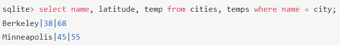
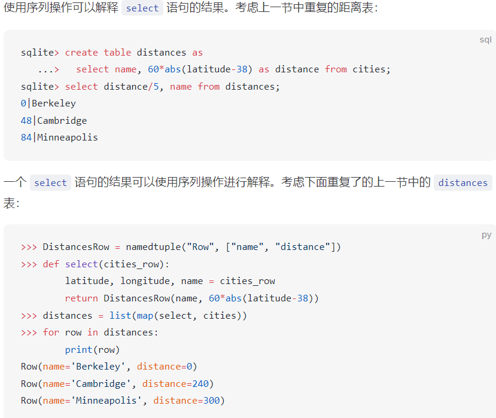

### 1.表
SQL中，使用select ... as ...语句创建单行表和多行表

通过 union 语句可以将两个表的行合并在一起，创建一个多行表。创建的表会使用左表的列名。且一行内的空格不会影响结果。

使用 create table 语句可以给表命名。虽然这个语句也可以用来创建空表，但我们将重点关注给已由 select 语句定义的现有表命名的形式，然后用select * from \<tablename> 来显示表的所有行
(要特别注意，如果是要作为值，字符串需要用双引号标注起来，不标注就是变量)

### 2.selec语句
select 语句可以通过列出单行的值或更常见的通过在 from 子句中使用现有表进行投影来定义一个新表：

select [column name] from [existing table name]
更一般地，可以通过select [column name1], [column name2], [column name3] from [existing table name] 来获取想要的某些列而不是所有列
生成的表的列由逗号分隔的表达式列表描述，每个表达式在现有输入表的每一行上都会被计算。
例:

列描述是一个语言中的表达式，它与 Python 具有许多相似之处：中缀运算符，如 + 和 %，内置函数，如 abs 和 round，以及用于描述计算顺序的括号。这些表达式中的名称，如上面的 latitude，在进行投影时求值为该行的列值。

可选地，每个表达式都可以跟随关键字 as 和列名。当整个表被命名时，通常有助于为每个列赋予一个名称，以便将来可以在选择语句中引用它。由简单名称描述的列会自动命名。

##### 2.1 where 子句 (用于过滤)
select 语句还可以包括一个带有过滤表达式的 where 子句。该表达式会对被投射的行进行过滤。只有当过滤表达式的计算结果为真时，才会使用该行来产生结果表中的一行。

##### 2.2 order 子句 (用于排序)
select 语句还可以对结果表达排序。Order 子句包含一个对于每个未过滤的行进行计算的排序表达式。该表达式的计算结果用作结果表的排序标准。

可用于select语句中的运算符：

### 3. 连接
数据库通常包含多个表，查询可能需要包含在不同表中的信息来计算所需结果。

当表进行连接时，结果表中会包含输入表中每个行的组合的新行。如果两个表进行连接，左表有 $m$ 行，右表有 $n$ 行，则连接表将有 $m n$ 行。连接在 SQL 中通过在 select 语句的 from 子句中用逗号分隔表名来表示

连接通常伴随着一个 where 子句，用于表达两个表之间的关系。例如，如果我们想将数据收集到一个表中，使纬度和温度相关联，我们会从连接中选择那些在每个表中都提到相同城市的行。在 cities 表中，城市名称存储在一个名为 name 的列中。而在 temps 表中，城市名称存储在一个名为 city 的列中。where 子句可以选择 join 表中这些值相等的行。在 SQL 中，使用单个 = 符号来进行数值相等的测试。

表可能具有重叠的列名，因此我们需要一种通过表名来消除歧义的方法。一个表也可以与自身连接，因此我们需要一种区分表的方法。为此，SQL 允许我们在 from 子句中使用关键字 as 给表命名别名，并使用点表达式引用特定表中的列。
例：

### 4. SQL解释器
以下讲的都是一种实现，可能会有其他实现
在这个实现中，每个表都有自己的类，并且表中的每一行都由其所属表的一个实例来表示。每行具有与表中每列对应的一个属性，而表是一个行的序列。

例:

### 5. 递归 select 语句
Select 语句可以选择性包含一个 with 子句，用于生成和命名计算最终结果所需的附加表。不包括 union 的 select 语句的完整语法如下：

with [tables] select [columns] from [names] where [condition] order by [order]

其中,
[tables] 部分是一个逗号分隔的列表，其中每个元素都是以下格式的表描述：
[table name]([column names]) as ([select statement])

可以姑且认为with子句中的select如果from了本表，就可以循环/递归地select直至条件不被满足

##### 5.1 构建字符串
在 SQL 中，可以使用 || 运算符将两个字符串连接成一个更长的字符串。

### 6. 聚合和分组

##### 6.1 聚合
到目前为止介绍的 select 语句可以连接、投影和操作单个行。此外，select 语句可以对多行执行聚合操作。聚合函数 max、min、count 和 sum 返回列中值的最大值、最小值、数量和总和。可以通过定义多个列将多个聚合函数应用于同一组行。只有 where 子句包含的列会在聚合中被考虑。

其中，"<>"和不等号意义相同
然后count(legs)用于统计所有legs非空的记录的数量
count(*)用于统计表中一共有多少条记录
count(distinct legs)用于统计legs在记录中一共有多少种不同的非空值

##### 6.2 分组
select 语句中的 group by 和 having 子句用于将行分成组，并仅选择部分组。having 子句或列描述中的任何聚合函数都将独立应用于每个组，而不是表中整个行集。

group by arg1,arg2...就是通过将原来的表用arg1,arg2,...进行进一步的划分，所有arg1-argn全相等的再划分成一类，就是把原来的表再细化成若干类，然后再进行select/聚合/having ...

GROUP BY [column name] clause takes all of the rows that have the same value in column name and groups them together.

having子句也是相当于过滤，把不满足条件的表项/group都过滤掉，往往配合聚合操作使用

having 子句可以包含与 where 子句相同的过滤条件，但也可以包括聚合函数的调用。为了获得最快的执行速度和最清晰的语言使用方式，应将基于其内容过滤单个行的条件放在 where 子句中，而只有在需要聚合条件时才应使用 having 子句（例如指定组的最小计数）。

