### 1.基本语法：
##### 1.1: 表达式
+,-,*,%
/:实数除
//：整除
**: 乘方
and,or,not:与、或、非
##### 1.2 字符串的表示:用""或‘’
##### 1.3 文档(docstring):""" strings """
(在help(funcname)里会显示)
##### 1.4 所有非零值在条件判断时都被翻译为True(包括负数)
因此，not -10的值为False
True and 0 == 0 (为啥不是False)
gpt:虽然0在布尔上下文中会被解释为False，但在逻辑运算的结果返回时，Python返回的是操作数的实际值，而不是它们的布尔值。
这种行为保持了Python中逻辑运算符的一致性和可预测性，允许它们不仅用于布尔逻辑计算，也可以用于条件表达式和其他需要根据多个操作数的值来决定结果的场景。

##### 1.5 函数调用表达式：


##### 1.6 变长参数的函数：
def func(*args):
    ...
    return ...
就行了，在参数前面加一个*args,表示args是变长参数
例：


另一个有点tricky的代码：


##### 1.7 在函数内修改全局变量：
global name
name=...

##### 1.8 递归式的写法
写递归式一定要注意收敛。如果写出来的递归式不收敛那很有可能是写错了，要重新写
还有一点要注意就是写递归函数的时候，要考虑目前的状态可以由哪些状态转化而来，而不是去考虑当前状态可以转移到哪些状态，而是哪些状态可以轻松转移到当前状态。同时也要注意这个“转移”要是“原子的”，一步到位就可以的

##### 1.9 List 的常用方法


注：extend是在原list的基础上，将原List的内容作为新list的第0项，插入lst，然后构成一个新的列表


##### 1.10 string的常用方法
1.字符串格式化：
1.1 用% , 像C语言一样
唯一不同的是python中只有一个%号，所有参数用括号括起来
```python
#!/usr/bin/python3

print ("我叫 %s 今年 %d 岁!" % ('小明', 10))
```
1.2 f-string
在字符串前面用f指示，在字符串里面用{表达式},可以在构造字符串的时候自动计算表达式的值，从而生成一个新的字符串
```python
>>> name = 'Runoob'
>>> f'Hello {name}'  # 替换变量
'Hello Runoob'
>>> f'{1+2}'         # 使用表达式
'3'

>>> w = {'name': 'Runoob', 'url': 'www.runoob.com'}
>>> f'{w["name"]}: {w["url"]}'
'Runoob: www.runoob.com'


python3.8:
>>> x = 1
>>> print(f'{x+1}')   # Python 3.6
2

>>> x = 1
>>> print(f'{x+1=}')   # Python 3.8
x+1=2
```

1.3 str.format
基本用法是用{}和:来替代%

```python
>>>"{} {}".format("hello", "world")    # 不设置指定位置，按默认顺序
'hello world'
 
>>> "{0} {1}".format("hello", "world")  # 设置指定位置
'hello world'
 
>>> "{1} {0} {1}".format("hello", "world")  # 设置指定位置
'world hello world'

```

也可以设置参数：
```python
#!/usr/bin/python
# -*- coding: UTF-8 -*-
 
print("网站名：{name}, 地址 {url}".format(name="菜鸟教程", url="www.runoob.com"))
 
# 通过字典设置参数
site = {"name": "菜鸟教程", "url": "www.runoob.com"}
print("网站名：{name}, 地址 {url}".format(**site))
 
# 通过列表索引设置参数
my_list = ['菜鸟教程', 'www.runoob.com']
print("网站名：{0[0]}, 地址 {0[1]}".format(my_list))  # "0" 是必须的

**site是python中的解包语法，对字典使用，把字典解析为等号
连接的键值对的表达式，像第一个中一样

输出结果：
网站名：菜鸟教程, 地址 www.runoob.com
网站名：菜鸟教程, 地址 www.runoob.com
网站名：菜鸟教程, 地址 www.runoob.com
```

数字格式化：
与C语言中一样，只是%变为了:
```python
>>> print("{:.2f}".format(3.1415926))
3.14
其他格式化也一样
```

此外我们可以使用大括号 {} 来转义大括号
```python
#!/usr/bin/python
# -*- coding: UTF-8 -*-
 
print ("{} 对应的位置是 {{0}}".format("runoob"))
```


2.字符串划分：把字符串按指定的字符串分割成许多小份
注意，python是通过字符串分割的，和C语言中分割的不太一样，C语言中是通过字符分割的，可以给很多字符，然后每个都去分割，各有利弊吧
```python
str.split(str="", num=string.count(str))

#!/usr/bin/python3
 
str = "this is string example....wow!!!"
print (str.split())        # 默认以空格为分隔符
print (str.split('i',1))   # 以 i 为分隔符
print (str.split('w'))     # 以 w 为分隔符

输出：
['this', 'is', 'string', 'example....wow!!!']
['th', 's is string example....wow!!!']
['this is string example....', 'o', '!!!']
```


##### 1.11 dict 常用方法


### 2.引用库(类似于#include)
from "libname/modulename" import "funcname"
这种方法是从指定模块中引用特定函数
import "modulename"
这种就是直接引用模块，可以使用模块中定义的任何函数(但是使用前要加modulename.funcname)


### 3.赋值/绑定
##### 3.1 基本逻辑：
数字的值就是它们所表示的数值
名称的值是环境中关联此名称的对象(数值/函数)

将名称与值绑定，之后通过名称检索可能的值，就意味着解释器必须维护某种内存来记录名称、值和绑定，这种内存就是环境（environment）

##### 3.2 一些操作
不仅可以给变量赋值为数值，还可以给变量赋值为函数，这样这个变量就变为了一个函数
(f=max f(a,b))
不仅如此，赋值不仅可以通过‘=’来赋值，也可以通过import,获得库函数里面一些定义好的常量
（from math import pi）
同样，也可以将某个函数绑定为一个值，这样之后这个函数名就不再代表一个函数了
(max=5)
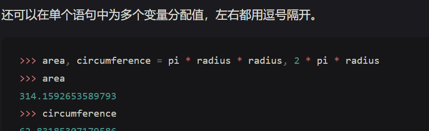

### 4 表达式求解
##### 4.1 环境的意义
注意环境在决定表达式中的符号意义上有重要作用。在 Python 中，不指定任何环境信息去谈论一个值是没有意义的，例如名称 x 和 add。环境为求解提供了上下文信息，对理解程序执行过程有着重要作用。
(add(x,1))

##### 4.2赋值语句
赋值语句的目的是将名称与值绑定，它并不返回值，也不应用参数去求解函数。也就是说，赋值语句不被求解但“被执行”，它们只是做出一些改变但不产生值。每种类型的表达式或语句都有自己的求解或执行过程。

注意：当我们说“一个数字求解为一个数值”时，实际上是 Python 解释器将数字求解为数值，是解释器赋予了编程语言这个意义。鉴于解释器是一个始终表现一致的固定程序，我们就可以说数字（以及表达式）会在 Python 程序的上下文中被求解为值。

### 5 函数与纯函数
纯函数（Pure functions）：函数有一些输入（参数）并返回一些输出（调用返回结果）

非纯函数（Non-pure functions）：除了返回值外，调用一个非纯函数还会产生其他改变解释器和计算机的状态的副作用（side effect）。一个常见的副作用就是使用 print 函数产生（非返回值的）额外输出。


##### 5.1 定义函数 
函数定义中出现的名称叫做 内在名称（intrinsic name），帧中的名称叫做 绑定名称（bound name）。两者之间有一个区别：不同的名称可能指的是同一个函数，但该函数本身只有一个内在名称。

函数签名：每个函数允许采用的参数数量有所不同。为了跟踪这些要求，我们绘制了每个函数的名称及其形式参数。用户定义的函数 square 只需要 x 一个参数，提供或多或少的参数都将导致错误。对函数形式参数的描述被称为函数的签名。

##### 5.2 局部帧与全局帧


##### 5.3 名称求解（Name Evaluation）：
名称的计算结果为该名称所在环境中的最早的帧中与它绑定的值。(类似于函数的全局变量、局部变量。以及变量的生存期、作用域等概念)

##### 5.4 函数命名一般准则


##### 5.5 抽象函数

域其实就是参数/自变量
范围其实就是函数返回值/因变量
意图其实就是函数的操作

##### 5.6 好函数的设计原则(PA中也有类似贯彻)：


##### 5.7 文档与注释


##### 5.8 参数默认值


##### 5.9 函数的真正定义与执行流


##### 5.10 闭包


### 6. 环境
求解表达式的环境由 帧 序列组成，它们可以被描述为一些盒子。每个帧都包含了一些 绑定，它们将名称与对应的值相关联。全局帧（global frame）只有一个。赋值和导入语句会将条目添加到当前环境的第一帧。


### 7.语句
##### 7.1 表达式与语句 

ps:程序就是一个状态机(确信)
表达式会被求解，而语句不会被求解而是执行，语句只是修改程序的状态机

##### 7.2 复合语句


##### 7.3 多行程序


##### 7.4 条件语句


##### 7.5 迭代语句


##### 7.6 断点


##### 7.7 doctest

在解释器命令行中输入如下，就可以获得doctest的结果


### 8. 高阶函数
##### 8.1 作为参数的函数


个人理解：在python中，函数和值的区别被进一步模糊了，任何一个变量可以表示函数，也可以表示数值。不禁让人想起C语言中的函数指针。可能python的函数在传参的时候用的都是指针，这样就可以解释了为什么变量和函数可以如此"无所顾忌"地随意使用
&emsp;
##### 8.2 作为通用方法的函数
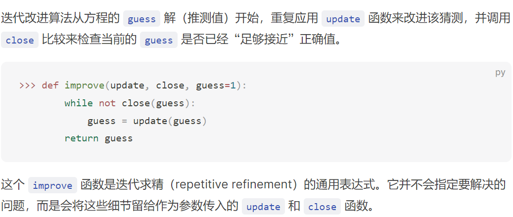
函数也可以定义为一种通用地计算方法，相当于一种函数模板，而与具体的，调用时使用的具体函数无关(其实也是一种常用地编程思想，在C里面也经常用，只是这里进一步拓展到了函数)

&emsp;

##### 8.3 函数的嵌套定义
通用方法函数的局限性

个人理解：碍于通用方法的限制(函数指针中也是类似的)，通用方法中可用的函数的参数数量是给定的，对于一个需要不同参数数量的函数来说，通用方法可能不太实用

解决方法：将函数定义在其他函数中
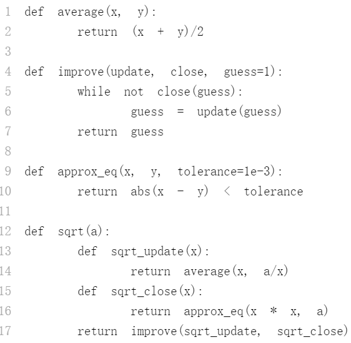


之前我们在全局环境中定义的函数可以引用全局变量，也是一个道理，相当于是这里的一个特例。说白了，就是父级环境创建的函数可以访问父级环境的资源


更进一步的，如果f1(sprt)中没有a的定义，那它就会去全局帧中寻找

(有点“面向对象方法”里面“继承”的感觉了)

##### 8.4 作为函数返回值的函数(构造复合函数)


##### 8.5 柯里化
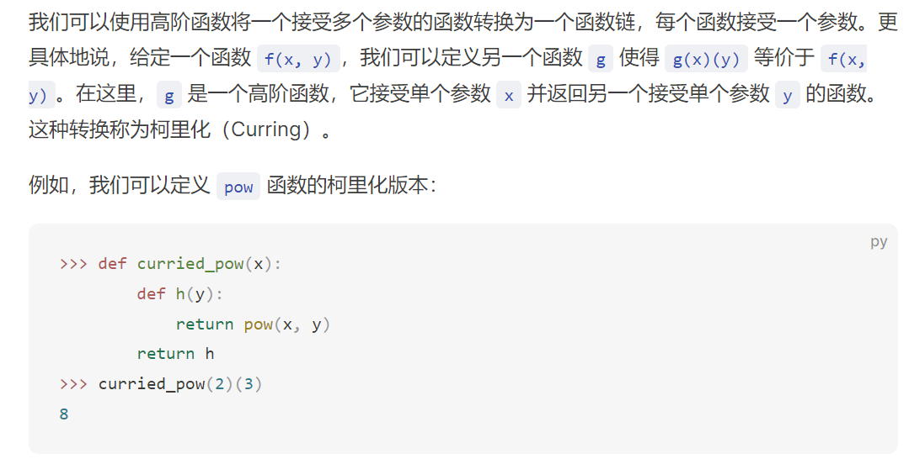


##### 8.6 lambda表达式 (匿名函数)
一个 lambda 表达式的计算结果是一个函数，它仅有一个返回表达式作为主体。不允许使用赋值和控制语句。
lambda表达式的返回值是一个函数，这个函数被调用时，lambda表达式的返回值(这个函数)会被执行
"note that the return expression of this function is not evaluated until the lambda is called"


##### 8.6 抽象和一等函数


##### 8.7 装饰器 decorator
Python 提供了一种特殊的语法来使用高阶函数作为执行 def 语句的一部分，称为装饰器（decorator）
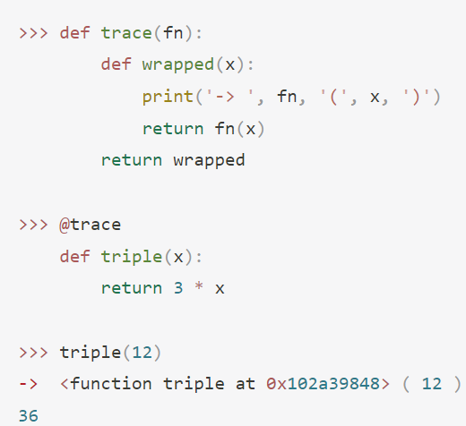


##### 8.8 高阶函数的应用
值得深思的两段代码：

第一段代码中，每次调用say_scores时都会先打印一串信息，然后返回自己，所以每次的返回值都是一个函数
第二段代码中，每次调用announce_lead_changes时，都会返回一个在announce_lead_changes，以它为父环境的一个子函数say
例如：
>>> f0=announce_lead_changes()
>>> f1=f0(23,32)

首先f0是一个say函数，它的父环境中，last_leader=None
然后当f1调用f0之后,f0又创建了一个新的父环境给f1,从而，在f1的父环境中，last_leader=1

##### 8.9 self reference


### 9.递归函数
和C语言中一样，不过是要注意各种边界
##### 9.1 示例：分割数


### 10.数据类型
##### 10.1 原始数据类型

原始数据类型具有以下属性：


注：不同于其他的编程语言，Python3 中的 int 值是无界的，也就是说它可以存储任意大小的数
同C语言一样，float也会有精度问题，最好不要直接==比较
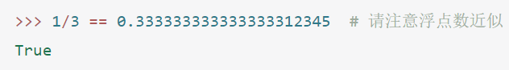

##### 10.2 抽象数据
使用复合数据可以使程序更加模块化。如果我们能够将地理位置作为整体值进行操作，那么我们就可以将计算位置的程序部分与位置如何表示的细节隔离开来，这种将“数据表示”与“数据处理”的程序隔离的通用技术是一种强大的设计方法，称为数据抽象。数据抽象会使程序更易于设计、维护和修改。
数据抽象与函数抽象类似。当我们创建一个函数抽象时，函数实现的细节可以被隐藏，而特定的函数本身可以被替换为具有相同整体行为的任何其他函数。换句话说，我们可以创建一个抽象来将函数的使用方式与实现细节分离。类似地，数据抽象可以将复合数据值的使用方式与其构造细节隔离开来。
“our programs should use data in such a way as to make as few assumptions about the data as possible. At the same time, a concrete data representation is defined as an independent part of the program.”
总结：就是程序在操作数据时，应尽可能少地假设数据地表示，而使用一些可以操作数据的接口(API),数据的具体表示应当作为程序的另一部分。这样，程序在操作数据的时候，即使数据的表示改变了，程序对数据的操作也可以产生同样的结果

“These two parts of a program, the part that operates on abstract data and the part that defines a concrete representation, are connected by a small set of functions that implement abstract data in terms of the concrete representation.”
表示数据和操作数据的程序由一组特殊的API来实现，这组API就是桥梁(类似用户程序、操作系统、硬件之间的关系)

一般来说，数据抽象的基本思想是确定一组基本操作，根据这些操作可以表达对某种值的所有操作，然后仅使用这些操作来操作数据。


(每一行就是一个抽象层，相邻行之间的夹层就是“抽象屏障”)
抽象屏障使程序更易于维护和修改。依赖于特定表示的函数越少，想要更改该表示时所需的更改就越少。

通常，我们可以使用选择器和构造器的集合以及一些行为条件来表达抽象数据。只要满足行为条件，选择器和构造器就构成了一种数据的有效表示。抽象屏障下的实现细节可能会改变，但只要行为没有改变，那么数据抽象就仍然有效，并且使用该数据抽象编写的任何程序都将保持正确。

##### 10.3 List
创建：
l=[ele1,ele2...]
访问元素：l[0],l[1]...
'[ ]'称为选择运算符

list 内置的 len 函数返回序列的长度。

多个列表间可以相加，并且列表可以乘以整数。对于序列来说，加法和乘法并不是作用在内部元素上的，而是对序列自身进行组合和复制。


序列遍历: for循环语句
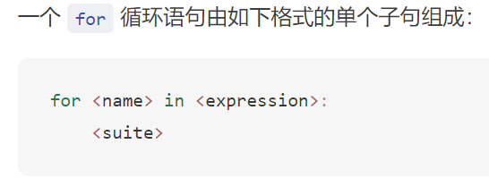


序列处理：
具有序列作为输入输出的模块化组件可以混用和匹配以实现数据处理。将序列处理流程中的所有操作链接在一起可以定义复杂组件，其中每个操作都是简单和集中的。

**列表推导式**（List Comprehensions）：许多序列操作可以通过对序列中的每个元素使用一个固定表达式进行计算，并将结果值保存在结果序列中。


**聚合**（Aggregation）：序列处理中的第三种常见模式是将序列中的所有值聚合为一个值。内置函数 sum、min 和 max 都是聚合函数的示例。
通过组合对每个元素进行计算、选择元素子集和聚合元素的模式，我们就可以使用序列处理的方法解决问题。


高阶函数与序列处理：


序列抽象：


```
List.insert(index,element)
表示在原List的基础上的位置为index的位置的"前面"插入element
```


##### 10.4 string


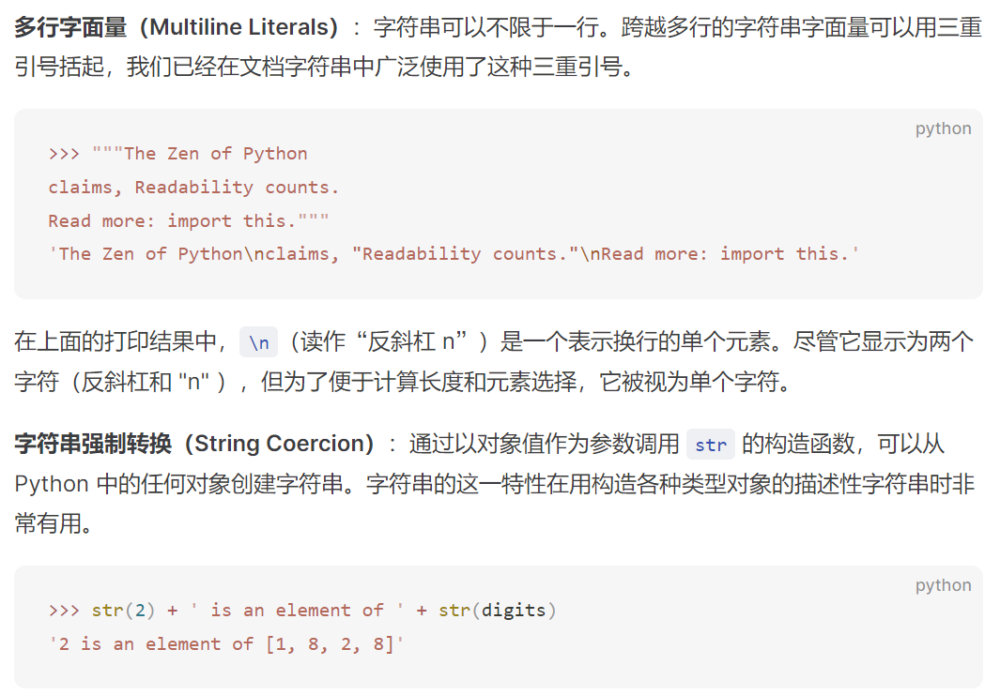

##### 10.5 Tree


##### 10.6 Links


### 10.7 隐式序列
一个序列（sequence）不一定要把每个元素显式存储在计算机的内存中。换句话说，我们可以建立一个对象（object），它提供对某个序列的访问，而无需事先计算每个元素的值。 取而代之，我们只在有需要的时候才计算元素。


##### 10.7.1 迭代器
迭代器是一种对象，提供对值逐一顺序访问的功能。 迭代器抽象有两个组件：

* 检索下一个元素的机制
* 到达序列末尾并且没有剩余元素，发出信号的机制

对迭代器使用next方法，返回值是*iter,也就是当前iter所指向的元素，副作用是将当前iter往后移动一位


旁注：try-except


    在Python中，当你对一个迭代器使用iter()函数时，它会直接返
    回那个迭代器本身，而不是创建一个新的迭代器作为副本。这一
    行为确保了当你需要对一个对象获取其迭代器时，你无需关心这
    个对象本身是否已经是一个迭代器，或者是一个可以迭代的容器
    （比如列表、元组等）。这样，无论你对一个迭代器还是对一个
    容器调用iter()，你都能得到一个迭代器，可以通过它来遍历对
    象中的元素。

    这与列表等容器的行为不同。对于列表这样的容器，每次你调用
    iter()时，实际上都会创建一个新的迭代器对象，即使你对同一
    个列表多次调用iter()，每次得到的迭代器也都是独立的，互不
    影响。

    这种设计允许更灵活的迭代操作，程序员无需担心在多次迭代时
    不小心创建了不必要的迭代器副本，也使得迭代器和可迭代容器
    的使用更加一致和简单。

范围（range）能够懒惰地计算序列的元素，因为所代表的序列是统一的，并且任何元素都可以从范围的起始和结束端点轻松计算得出。 迭代器允许对更广泛的基础连续数据集进行懒惰生成，因为它们不需要提供对基础系列的任意元素的访问。

相反，迭代器只需要按顺序计算系列的下一个元素，每次请求另一个元素时进行计算。 虽然不如访问序列的任意元素（称为随机访问）灵活，但对于数据处理应用程序来说，对连续数据的顺序访问通常是足够的。

##### 10.7.2 可迭代性

(现在 Python 3.6+ 版本，字典的顺序是键值对（key-value pair）加入字典时的顺序)

旁注：

注意，对于set这种无序的可迭代对象，程序员无法预测迭代器的迭代顺序

##### 10.7.3 内置迭代器


##### 10.7.4 for语句


(tips:意思就是说对于python中的迭代器对象，也要支持next和iter方法，以便在for语句中，用到for ... in iter的时候也可以正常工作)

##### 10.7.5 生成器，生成器函数，Yield语句

生成器：由一种特殊类型的函数 **生成器函数** 返回的**迭代器**。 生成器函数与常规函数不同之处在于，它们在其主体内不包含 return 语句，而是使用 yield 语句来返回一系列元素。

生成器函数：函数主体内不包含 return 语句，而是使用 yield 语句来返回一系列元素。每次执行到yield语句就返回yield后面紧跟的对象，下次再被调用时从yield后面的语句再次执行，找到又执行到yield语句
tip:将生成器函数调用的结果赋值给某个变量之后，生成器函数不会立刻执行，而是会在下一次调用next方法的时候才会执行到yield语句

生成器（Generators）使我们能够通过利用 Python 解析器（Interpreter）的功能来定义更复杂的迭代。生成器不使用对象的属性来跟踪它们在序列中的进度。 相反，它们控制生成器函数的执行，在每次调用生成器的 `__next__`方法时执行，直到下一个 yield 语句被执行为止。使用生成器函数可以更简洁地实现 Letters 迭代器。


旁注：


##### 10.7.6 可迭代接口

注:LetterIter 类的定义见10.7.8
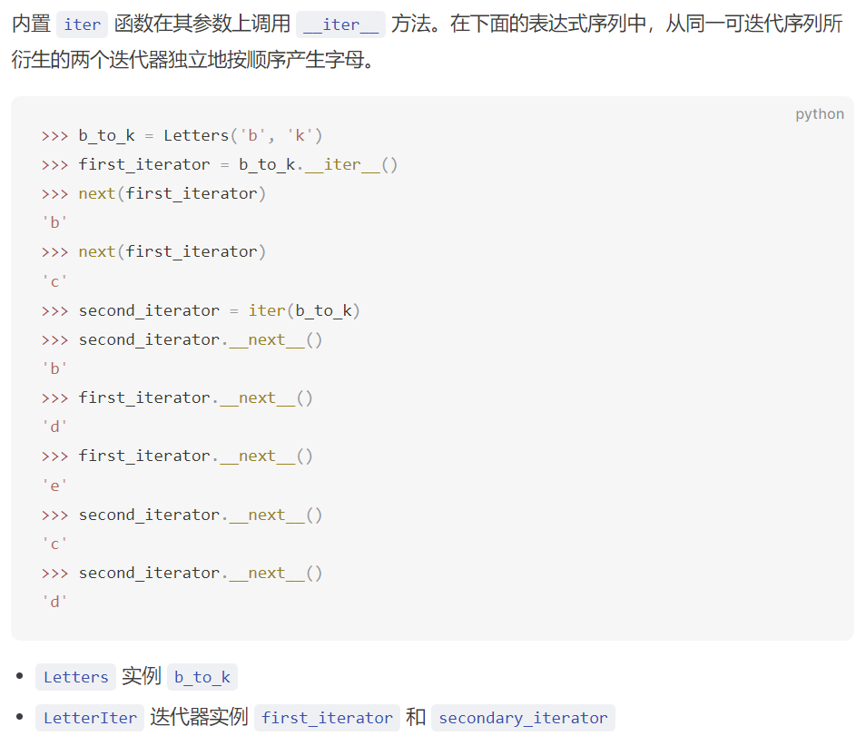


##### 10.7.7 使用 Yield 创建可迭代对象
哦，这里的意思就是说，如果自己定义了一个可迭代对象，那么对于`__iter__`的返回值，应该是一个可迭代对象，而这个可迭代对象也是要你自己去定义，为其写`__iter__`和`__next__`方法，但是如果使用yield，就可以直接用用生成器这样一个类似迭代器的东西来避免多余的定义和编程


tip:
yield from 语句：
yield from iterable 是其基本用法，iterable表示一个可迭代对象，yield from 省去了在循环中一个一个yield的过程，而直接生成每一个iterable中的对象
例：
```python
>>> def gen_list(lst):
...     yield from lst
...
>>> g = gen_list([1, 2, 3, 4])
>>> next(g)
1
>>> next(g)
2
>>> next(g)
3
>>> next(g)
4
>>> next(g)
StopIteration
```

yield from iterable 后面的iterable也可以是一个generator!!!
example:
```python
def filter_link(link, f):
    """
    >>> link = Link(1, Link(2, Link(3,Link(5,Link(4)))))
    >>> g = filter_link(link, lambda x: x % 2 == 0)
    >>> next(g)
    2
    >>> next(g)
    StopIteration
    >>> list(filter_link(link, lambda x: x % 2 != 0))
    [1, 3]
    """
    if link is Link.empty:
        return
    if f(link.first):
        yield link.first

    yield from filter_link(link.rest, f)  # yield from 这个用法就很屌啊

```

##### 10.7.8 迭代器接口
迭代器也是对象，需要特别定义


##### 10.7.9 python流
流（Streams）提供了另一种隐式表示连续数据的方法。 Stream 是一个惰性计算的链表（linked-list）。 类似于第 2 章中的 Link 类， Stream 实例会对其第一个元素和其余（rest）部分的请求做出响应。就像 Link 一样， Stream 的其余部分本身也是一个 Stream 。但与 Link 不同的是， Stream 的其余部分仅在查找时计算，而不是提前存储。也就是说， Stream 的其余部分是惰性计算的。
    
    tip:"@property”修饰符使得修饰的函数像属性一样可直接访问
    （只能每个@property 装饰器只能修饰一个函数）


注：这个埃氏筛的思想其实就是从2开始从小到大枚举所有还存在的数把所有能整除这些数的数都筛掉，就是先按2筛，再按3，然后按5...直到筛到指定的数量就停下。然后在python中这个特性就非常简明

* 迭代器的一些api:


### 11. 可变数据

##### 11.1 对象


不仅 date 是对象，我们之前提到的数字、字符串、列表、区间等都是对象。它们本身表示数据，同时还拥有它们所代表的数据的行为。它们还有属性和方法。

实际上，Python 中所有的值都是对象。也就是说，所有的值都有行为和属性，它们拥有它们所代表的数据的行为。

##### 11.1.2 序列对象


类似于C++中的浅拷贝


Python 提供了 **is** 和 **is not** 两种比较操作符来验证两个变量是否指向同一个对象。如果两个对象的值完全相等，则说明它们两个是同一个对象，对其中任意一个对象的改动都将影响到另外一个。身份验证比简单的相等验证更准确。


##### 11.1.3 元组对象


ex:
nest = (10, 20, [30, 40])
nest[2].pop()

在批量赋值的场景下，元组会被隐式地使用到。将两个值批量赋值给两个变量时，实际上是创建了一个包含两个元素的元组，然后对其进行解构赋值。

进阶：  namedtuple
能让元组像字典一样通过名字去引用，但是不可变
```python
from collections import namedtuple

# 创建一个名为“Person”的namedtuple，具有“name”和“age”两个字段
Person = namedtuple('Person', ['name', 'age'])

# 使用Person创建一个对象
person1 = Person('Alice', 30)

# 访问字段
print(person1.name)  # 输出: Alice
print(person1.age)   # 输出: 30

# namedtuples 也是不可变的
# person1.age = 31  # 这会抛出 AttributeError

# namedtuple 也支持解包和索引
name, age = person1
print(name)  # 输出: Alice
print(person1[1])  # 输出: 30

```

namedtuple其实是创建了一个类，然后通过这个类去实例对象


##### 11.2 字典
字典（Dictionary）是 Python 的内置类型，用来存储和操作带有映射关系的数据。一个字典包含一组键值对（key-value pairs），其中键和值都是对象。字典的主要目的是抽象一组基于键值对的数据，在字典中，数据的存取都是基于带有描述性信息的键而不是连续递增的数字。

字典的 key 一般都是字符串（String），因为我们习惯用字符串来表示某个事物的名称。


Python 3.7 及以上版本的字典顺序会确保为插入顺序，此行为是自 3.6 版开始的 CPython 实现细节，字典会保留插入时的顺序，对键的更新也不会影响顺序，删除后再次添加的键将被插入到末尾


旁注:


##### 11.3 局部状态
##### 11.3.1 非局部语句
列表和字典拥有局部状态（local state），即它们可以在程序执行过程中的某个时间点修改自身的值。状态（state）就意味着当前的值有可能发生变化。

函数也是有状态的(例如，修改全局变量的函数，每次返回值可能不一样)
更确切地说，非纯函数（in-pure）。执行这个函数在返回内容的同时，还产生了其它副作用（side effects），导致多次调用同一个函数得到的结果却不相同。这里的副作用之所以会出现，是因为 非纯函数更改了它所在的栈帧之外的变量。(非纯函数就是这么定义的)


Python 中 nonlocal 声明的效果：当前执行帧之外的变量可以通过赋值语句更改。
非局部语句（nonlocal statement）会改变 withdraw 函数定义中剩余的所有赋值语句。在将 balance 声明为 nonlocal 后，任何尝试为 balance 赋值的语句，都不会直接在当前帧中寻找并更改 balance，而是找到定义 balance 变量的帧，并在该帧中更新该变量。如果在声明 nonlocal 之前 balance 还没有赋值，则 nonlocal 声明将会报错。

嵌套定义的函数可以在访问其作用域之外的变量。访问 nonlocal 声明的变量名称并不需要使用非局部语句。相比之下，只有在非局部语句之后，函数才能更改这些帧中名称的绑定。

通过引入非局部语句，我们为赋值语句创建了双重作用。他们可以更改局部绑定 (local bindings)，也可以更改非局部绑定 (nonlocal bindings)。事实上，赋值语句已经有了很多作用：它们可以创建新的变量，也可以为现有变量重新赋值。赋值也可以改变列表和字典的内容。


*旁注*：

局部帧可以有多个，因为每个函数调用都会创建一个新的局部帧，但全局帧只有一个，因为整个程序共享同一个全局作用域。

在这个层次结构中，nonlocal语句允许我们引用并修改这个层次结构中的上一层（非全局）作用域的变量。这意味着使用nonlocal关键字声明的变量必须已经存在于外层函数的局部作用域中，这样内层函数才能修改外层函数作用域内的变量值，而不是在自己的局部作用域中创建一个新的变量或者修改全局变量。这种机制使得嵌套函数之间能够共享和修改相同的变量，从而实现更复杂的函数逻辑和状态管理。


如果在上述函数中，删除了withdraw中的nonlocal标识，那么就会出现 UnboundLocalError ，是因为 balance 在第 5 行中被赋值，因此 Python 假定对 balance 的所有引用也必须出现在当前帧中。这个错误发生在第 5 行执行之前，这意味着 Python 在执行第 3 行之前，就以某种方式考虑了第 5 行的代码。等我们研究解释器设计的时候，我们就会看到在执行函数体之前预先计算有关函数体的实际情况是很常见的。此时，Python 的预处理限制了 balance 可能出现的帧，从而导致找不到对应的变量名。

##### 11.3.2 非局部 Non-local 赋值的代价
当两个名称 wd 和 wd2 都绑定到一个 withdraw 函数时，它们是绑定到同一个函数还是绑定到该函数的不同实例是很重要的。
example:

    wd = make_withdraw(12)
    wd2 = wd
那么 wd和wd2都是关联到同一个函数，所用的balance也是同一个，相当于共享了

两个名字在世界上共同指代同一个值并不罕见，在我们的程序中也是如此。但是，因为值会随时间变化，我们必须非常小心地理解变化对可能引用这些值的其他名称的影响。

正确理解包含 nonlocal 声明的代码的关键是记住：只有函数调用才能引入新帧。赋值语句只能更改现有帧中的绑定关系。在这种情况下，除非 make_withdraw 被调用两次，否则只能有一个 balance 绑定。


旁注：


##### 11.4 列表与字典实现 (利用nonlocal)
非常头脑风暴的一集：列表/字典/可变数据 其实是一个函数！


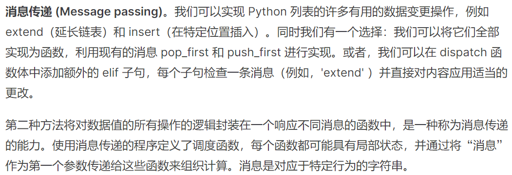


The built-in dictionary data type provides a general method for looking up a value for a key. Instead of using conditionals to implement dispatching, we can use dictionaries with string keys.


These functions have access to the dispatch dictionary, and so they can read and change the balance. By storing the balance in the dispatch dictionary rather than in the account frame directly, we avoid the need for nonlocal statements in deposit and withdraw.

旁注：
关于“为什么dispatch这个字典中的deposit函数会绑定到函数account内部定义的deposit函数而不是全局的deposit函数”问题的解答：


##### 11.5 综合应用：Propagating Constraints系统
声明式编程(declarative programming)


最终实现效果：


api用途


constraint具体实现:
一个约束的关键在于：
1.它关联哪些connector
2.它的new_value和forget_value行为如何
3.当然，关于常量约束，可以验证，在设置的时候，只要不去动常量，那常量就一直不会被设置，从而保持正确


connector具体实现：
informant为发起修改connector的value的那个constraint
constraints为这个connector所接收的所有约束组成的列表
source为向connector发起修改/遗忘操作的那个约束
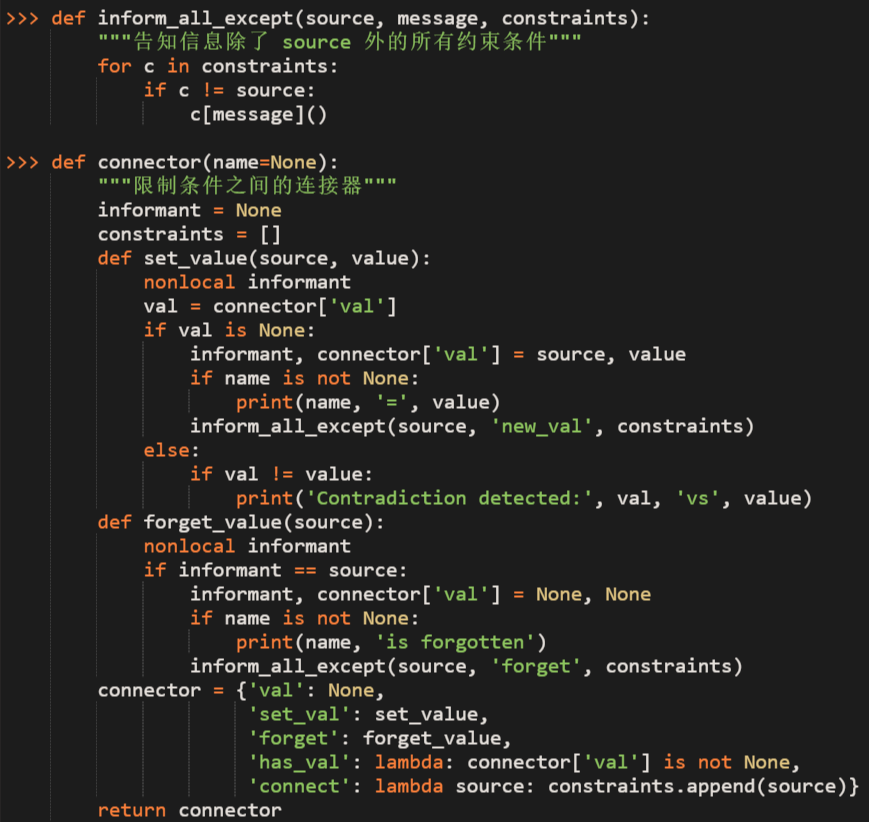
因为每次set_value之后会通知周围所有的约束修改相关的connector，但不会因此陷入死循环，因为当一个value已经被设定后，那么就不会再通知其他变量进行调整了


### 12.面向对象编程
与数据抽象中的函数一样，类创建了在使用和实现数据之间的抽象屏障。与调度字典（dispatch dictionaries）一样，对象响应行为请求。与可变数据结构一样，对象具有无法从全局环境直接访问的本地状态。
每个对象都以抽象两者(本地状态和行为)的复杂性的方式将本地状态和行为捆绑在一起

旁注：


##### 12.1 对象与类
类就像一个模板，对象是按照模板（类）生成的实例。到目前为止我们使用的对象都有内置类，但也可以创建新的用户定义类。类定义指定在该类的对象之间共享的属性和方法。
创建新对象实例的操作称为实例化类。Python 中用于实例化类的语法与调用函数的语法相同。
例如
    
    >>> a = Account('Kirk')
    实例化了一个Account对象
对象的属性是与对象关联的名称 - 值对，可通过点表达式访问。对于特定对象，其有特定值的属性，（而不是类的所有对象）称为实例属性。每个 Account 都有自己的余额和账户持有人姓名，这是实例属性的示例。
例如：

    >>> a.holder
    'Kirk'
    >>> a.balance
    0
对对象进行操作或执行特定于对象的计算的函数称为方法。方法的返回值和副作用可以依赖于并更改对象的其他属性。

    >>> a.deposit(15)
    15

方法是在特定对象上调用的。方法的行为可能取决于对象不断变化的属性，方法也可以改变对象的属性。具有相同参数的两次对 withdraw 的调用将返回不同的结果。

    >>> a.withdraw(10)  # withdraw 方法返回扣除后的金额
    5
    >>> a.balance       # 金额属性发生改变
    5
    >>> a.withdraw(10)
    'Insufficient funds'

##### 12.2 类的定义

* self参数有点类似于C++中的this指针


python中的赋值好像都是浅拷贝？


##### 12.3 消息传递和点表达式
在类中定义的方法和在构造函数中分配的实例属性是面向对象编程的基本元素。这两个概念在传递数据值的消息实现中复制了调度字典的大部分行为。对象使用点表达式获取消息，但这些消息不是任意字符串值键，而是类的本地名称。对象还具有命名的本地状态值（实例属性），但可以使用点表达式访问和操作该状态，而无需在实现中使用 nonlocal 语句。

The central idea in message passing was that data values should have behavior by responding to messages that are relevant to the abstract type they represent. Dot notation is a syntactic feature of Python that formalizes the message passing metaphor. The advantage of using a language with a built-in object system is that message passing can interact seamlessly with other language features, such as assignment statements. We do not require different messages to "get" or "set" the value associated with a local attribute name; the language syntax allows us to use the message name directly.

python中，expression可以是一个最终为对象的表达式，但是name一定要是一个直接的名字(数据/函数)


**方法和函数：**
作为类的属性，方法只是一个函数，但作为实例的属性，它是一个绑定方法：

    >>> type(Account.deposit)
    <class 'Function'>
    >>> type(spock_account.deposit)
    <class 'method'>

这两个结果的区别仅在于第一个是参数为 self 和 amount 的标准双参数函数。第二种是单参数方法，调用方法时，名称 self 将自动绑定到名为 spock_account 的对象，而参数 amount 将绑定到传递给方法的参数。这两个值（无论是函数值还是绑定方法值）都与相同的 deposit 函数体相关联。


The function getattr behaves exactly like dot notation: if its first argument is an object but the name is a method defined in the class, then getattr returns a bound method value. On the other hand, if the first argument is a class, then getattr returns the attribute value directly, which is a plain function.


**命名约定**：类名通常使用 CapWords 约定（也称为 CamelCase，因为名称中间的大写字母看起来像驼峰）编写。方法名称遵循使用下划线分隔的小写单词命名函数的标准约定。

在某些情况下，有一些实例变量和方法与对象的维护和一致性相关，我们不希望对象的用户看到或使用。它们不是类定义的抽象的一部分，而是实现的一部分。Python 的约定规定，如果属性名称以下划线开头，则只能在类本身的方法中访问它，而不是用户访问。

##### 12.4 类属性
某些属性值在给定类的所有对象之间共享。此类属性与类本身相关联，而不是与类的任何单个实例相关联。(C++ ::静态数据(static))

类属性由 class 语句套件中的赋值语句创建，位于任何方法定义之外。


**属性名称** 现在实例对象里面找，找不到再在类里面找
隐含地，其实每个实例对象只有一部分数据，函数都是在类里面的


##### 12.5 继承

在面向对象编程范式中，我们经常会发现不同类型之间存在关联，尤其是在类的专业化程度上。即使两个类具有相似的属性，它们的特殊性也可能不同。

CheckingAccount 是 Account 的特化。在 OOP 术语中，通用帐户将用作 CheckingAccount 的基类，而 CheckingAccount 将用作 Account 的子类。术语基类（base class）也常叫父类（parent class）和超类（superclass），而子类（subclass）也叫孩子类（child class）。

继承旨在表示类之间的 is-a 关系，这与 has-a 关系形成对比。活期账户是一种特定类型的账户，因此从 Account 继承 CheckingAccount 是继承的适当使用。


Even though the deposit method was found in the Account class, deposit is called with self bound to an instance of CheckingAccount, not of Account.

**调用父类** ：重写的属性可以通过类对象来访问。例如，我们通过调用 CheckingAccount 中包含 withdraw_charge 参数的方法 withdraw 。该方法的实现是通过调用 Account 中的 withdraw 方法来实现的。

请注意，我们调用了 self.withdraw_charge 而不是等效的 CheckingAccount.withdraw_charge 。前者相对于后者的好处是，从 CheckingAccount 继承的类可能会覆盖 withdraw_charge 。如果是这种情况，我们希望我们的实现的 withdraw 找到**新值**而不是旧值。(就是说继承的类会有自己的charge，但是这个charge和CheckingAccount.withdraw_charge互不干扰，但是那个继承的类也要用自己的charge使用这个方法时，必须在这种情况下才是对的)

**接口**: 在面向对象的程序中，不同类型的对象将共享相同的属性名称是极其常见的。对象接口是这些属性的属性和条件的集合。例如，所有帐户都必须具有采用数值参数的 deposit 和 withdraw 方法，以及 balance 属性。类 Account 和类 CheckingAccount 都实现此接口。继承（Inheritance）专门以这种方式促进名称共享。


上面的函数 deposit_all 仅假设每个 account 满足帐户对象抽象，因此它将与也实现此接口的任何其他帐户类一起使用。

##### 12.6 多继承 
和C++差不多，就是在单继承的基础上通过逗号分隔多个父类：


##### 12.7 一些不太常用的api

1.isinstance(instance ,class)
用于判断实例是不是属于class类


### 13.类与对象的python实现
python中，所有的类都共享同一个类类型，叫做 type


接下来我们通过字典、函数等方式构建一个自己的"对象系统"，仍然以之前的银行账户为例：


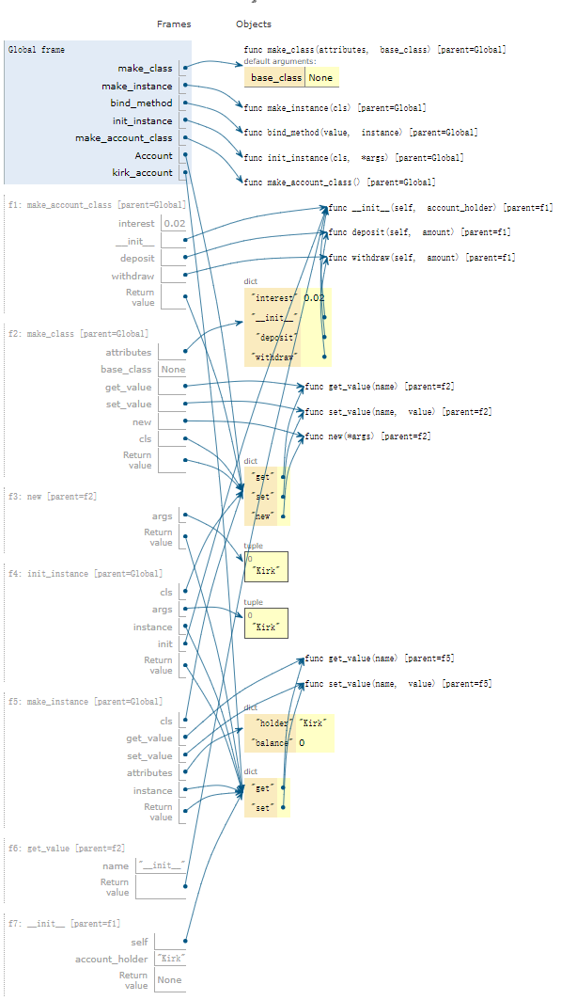


### 14.对象抽象
类似于C++中的模板/类属 ？
python中，一切皆对象！

三种不同的用于实现泛型函数的技术：共享接口，类型派发和类型强制转换
##### 14.1 python中的字符串表示
Python 规定所有的对象都应该生成两个不同的字符串表示：一种是人类可读的文本，另一种是 Python 可解释的表示式。字符串的构造函数，即 str，返回一个人类可读的字符串。如果可能，repr 函数返回一个 Python 可解释的表达式，该表达式的求值结果与原对象相同
对于大多数对象类型，eval(repr(object)) == object


##### 14.2 专用方法
在 Python 中，某些特殊名称会在特殊情况下被 Python 解释器调用。例如，类的 __init__方法会在对象被创建时自动调用。      __str__方法会在打印时自动调用，__repr__方法会在交互式环境显示其值的时候自动调用。

在 Python 中有一些为其他行为而准备的特殊名称。下面介绍其中某些常用的


**可调用对象**:在 Python 中函数是一等对象，因此它们被作为数据进行传递，并且像其他对象那样拥有属性。Python 还允许我们定义像函数一样可以被“调用的对象”，只要在对象中包含一个 __call__方法


有点像操作符重载？


##### 14.3 多重表示
抽象障碍允许我们分离数据的使用和表示。然而在大型程序中，讨论数据类型的“底层表示”可能并不总是有意义。首先，一个数据对象可能由不止一种有用的表示，我们也许会想要设计能够处理多种表示形式的系统。

以一个简单的例子而言，复数可以用两种几乎相同的方式来表示：直角坐标系（实部和虚部）和极坐标系（幅度和角度）。有时直角坐标系更合适而有时极坐标系更合适。事实上，我们可以想象这样一个系统，复数在其中同时以两种形式表示，并且操作复数的函数可以处理任何一种表现形式。我们接下来实现这样的一个系统。

不可能让所有人都事先对于数据的表示达成一致的选择。除了使用数据抽象屏障将表示与使用隔离外，我们还需要抽象屏障来隔离不同的设计选择并允许不同的选择在同一个程序中共存。

**接口**：
说白了就是一个类的一些属性以及操作这些属性的规范
Object attributes, which are a form of message passing, allows different data types to respond to the same message in different ways. A shared set of messages that elicit similar behavior from different classes is a powerful method of abstraction. An interface is a set of shared attribute names, along with a specification of their behavior. In the case of complex numbers, the interface needed to implement arithmetic consists of four attributes: real, imag, magnitude, and angle.


**属性**：
The requirement that two or more attribute values maintain a fixed relationship with each other is a new problem. One solution is to store attribute values for only one representation and compute the other representation whenever it is needed.


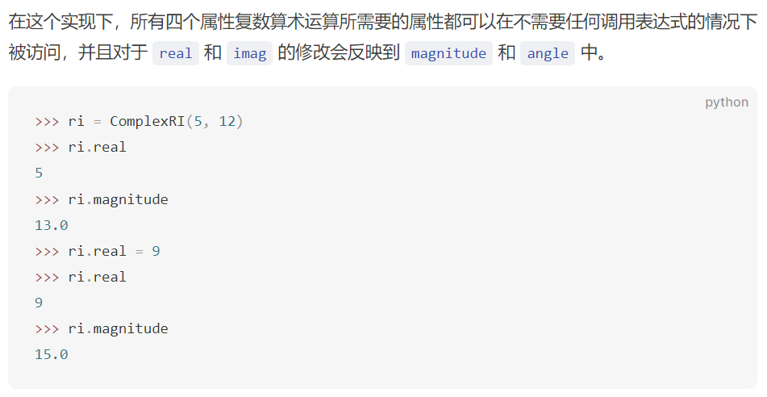


使用接口来编码多重表示具有十分吸引人的特点。每一种表示形式的类都可以被单独开发；它们只需要就它们共享的属性名称和和对于这些属性的行为条件达成一致。接口还具有可添加性。如果程序员想要添加一个复数的第三方表现形式到同一个程序中，他们只需要创建一个拥有相同属性名称的类即可。

数据的多重表现形式和我们本章开始提到的数据抽象的概念联系密切。使用数据抽象，我们可以改变数据类型的实现而不需要改变程序的含义。通过接口和数据传递，我们可以在同一个程序中拥有多种不同的表现形式。在这两种情况下，一组名称和相应的行为条件定义的抽象使这种灵活性成为了可能。

##### 14.4 泛型函数
使用接口和消息传递只是多种可以被用于实现泛型函数的方法中的一种。在本节我们将会考虑另外两个方法：类型派发和类型强制转换。

问题引入：

然而，我们还不能把一个分数加到复数上，即使这样的结合在数学上已经有了准确的定义。我们希望以某种精心受控制的方式引入这种跨类型的操作。以便在不严重违反我们的抽象屏障的情况下支持它。在我们期待的结果中存在着一种矛盾：我们希望能够将一个复数和一个分数相加，并且我们想要使用泛型的 __add__ 方法来正确的处理所有的数值类型。同时我们希望尽可能地分离复数和分数地关注点，以维护一个模块化的程序

问题解决：
##### 14.4.1 类型派发 (Type dispatching)
一种实现跨类型操作的方式是选择基于函数或方法的参数类型来选择相应的行为。类型派发的思想是写一个能够检查它所收到的参数的类型的函数，然后根据参数类型执行恰当的代码。


类型派发的作用是保证这些跨类型的操作能在恰当的时候被使用。接下来，我们重写 Number 超类来为它的 __add__和 __mul__方法使用类型派发。

我们使用 type_tag 属性来区分参数的类型。也可以直接使用内置的 isinstance 方法，但是使用标签可以简化实现。使用类型标签也可以说明类型派发并不是必然和 Python 对象属性相联系的。而是一种在异构域上创建泛型函数的通用技术


基于字典的类型派发是可扩展的。Number 的新子类可以通过声明新的类型标签并添加跨类型操作到 Number.adders 和 Number.multipliers 中来将自己安装到系统中。它们还可以在子类中定义自己的 adders 和 multipliers,这是需要学习的，很好的软件工程思想，也注意到，扩展性的具体实现就是在于self.adders和self.multipliers

##### 14.4.2 强制转换 (Coercion)
In the general situation of completely unrelated operations acting on completely unrelated types, implementing explicit cross-type operations, cumbersome though it may be, is the best that one can hope for.Fortunately, we can sometimes do better by taking advantage of additional structure that may be latent in our type system. Often the different data types are not completely independent, and there may be ways by which objects of one type may be viewed as being of another type. This process is called coercion.


这个强制转换方案相比定义确定的跨类型操作具有一些优势。即是我们仍然需要写强制转换函数将各种类型联系起来，但对于每个类型对只需要一个函数而不是对每组类型和每个通用操作都编写不同函数。我们在这里依赖一个事实，即类型之间恰当地转换仅仅取决于类型自身，而与被应用到的特定操作无关。

扩展强制转换可以带来更多优势。一些更加精于设计的强制转换方案不仅仅只是尝试将一种类型转换到另一种，而是会尝试将两种不同的类型都转换为第三种通用类型。例如一个菱形和一个矩形：它们都不是对方的特殊情况，但是它们都可以被看作四边形。另一种强制转换的扩展是迭代强制转换，将一种数据类型通过中间类型转换到另一种类型。例如整数可以通过第一次转换成有理数，然后从有理数转换为实数。链式强制转换可以减少程序中所要求的强制转换的函数总量。

即是有很多优势，但是强制转换也有潜在的缺点。例如，强制转换函数可能在应用时丢失信息。在我们的例子中，分数是准确的表示，但是当它被转换成复数时则变成了近似值


### 15.效率
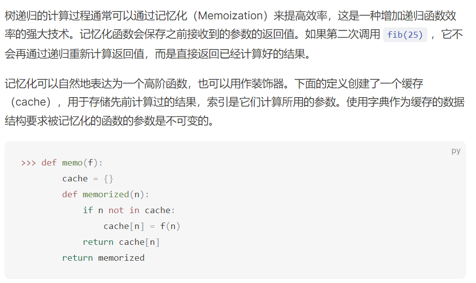
记忆化函数


### 16.递归对象
对象可以以其他的对象作为自己的属性值。当这个类下的对象实例有一个属性的值还属于这个类时，这个对象就是一个递归对象。

##### 16.1 链表类
链表 (Linked List) 由两个部分组成：第一个元素和链表剩下的部分。而剩下的这部分链表它本身就是个链表，这就是链表的递归定义法。其中，一个比较特殊的情况是空链表——他没有第一个元素和剩下的部分。

现在我们可以实现具有相同行为的类。在现在这个版本中，我们将使用专用方法名来定义它的行为，专用方法允许我们的类可以使用 Python 内置的 len 函数和元素选择操作符（方括号或 operator.getitem ）。这些内置函数将调用类的专用方法：长度由 __len__计算，元素选择由 __getitem__计算。空链表由一个长度为 0 且没有元素的空元组表示。


内置的 isinstance 函数返回第一个参数的类型是否属于或者继承自第二个参数。isinstance(rest, Link) 在 rest 是 Link 的实例或 Link 的子类的实例时为 True


**递归构造 (Recursive Construction)**: 当以增量方式构造序列时，链表特别有用，这种情况在递归计算中经常出现

第一章我们介绍过的函数 count_partitions 通过树递归计算了使用大小最大为 m 的数对整数 n 进行分区的方法的个数。通过序列，我们还可以使用类似的过程显式枚举这些分区。


##### 16.2 树类
树也可以用用户定义的类的实例来表示，而不是内置序列类型的嵌套实例。树是具有 作为属性的分支序列 的任何数据结构，同时，这些分支序列也是树。

**内部值** ：每个子树的根处定义具有内部值的树也很常见。内部值在树中称为 label。下面的 Tree 类就表示这样的树，其中每棵树都有一系列分支，这些分支也是树。
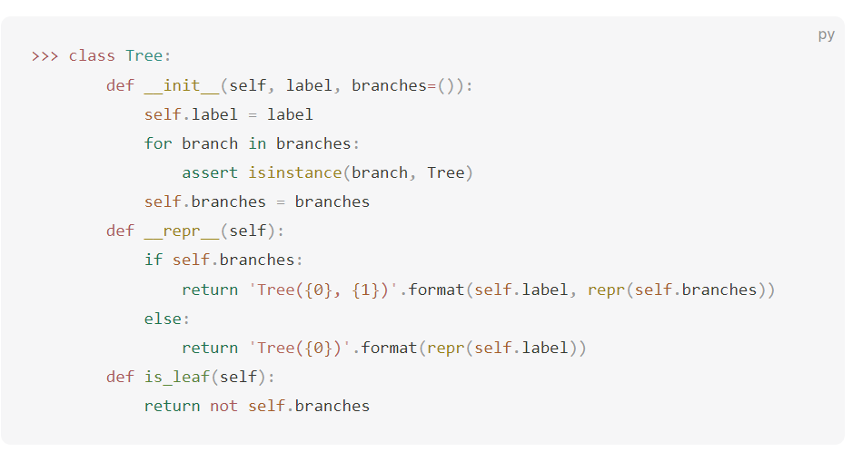


memo的定义可见效率一章中的memo，就是用高阶函数，维护一个该函数所有调用过的参数对应结果

旁注：memo


##### 16.3 集合
集合字面量遵循了它的数学表示法：用大括号括起来元素们。重复的元素会在创建集合时被移除。集合是无序的，这表明元素被打印的顺序可能和他们在字面量中的顺序不同。

    >>> s = {3, 2, 1, 4, 4}
    >>> s
    {1, 2, 3, 4}


旁注：关于set的更多method


集合的实现：
方法1：无序集合


方法2：递增集合


方法3：二叉搜索树(红黑树/AVL树)


注：交集和并集操作可以在线性时间内通过将树结构转换为有序列表和返回来执行。


Python 的集合实现方法：Python 内置的 set 类型不使用任何这些表示。相反，Python 使用一种表示法，该表示法基于一种称为哈希（hashing）的技术提供恒定时间的成员关系测试和相邻操作，这是另一门课程的主题。内置的 Python 集合不能包含可变数据类型，如列表、字典或其他集合。为了允许嵌套集，Python 还有一个内置的不可变 frozenset 类，它与 set 类共享方法，但不包括改变方法和操作符。

### 17.编程语言
A Python program is just a collection of text. Only through the process of interpretation do we perform any meaningful computation based on that text. A programming language like Python is useful because we can define an interpreter, a program that carries out Python's evaluation and execution procedures. It is no exaggeration to regard this as the most fundamental idea in programming, that an interpreter, which determines the meaning of expressions in a programming language, is just another program.

一个python程序就是一系列的text,而使得这些text有意义，需要一个名为解释器(interpreter)的程序来解释这些text的行为并执行相应的计算


