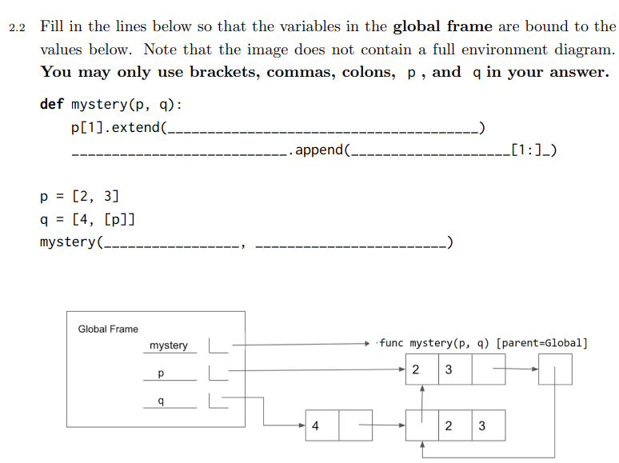
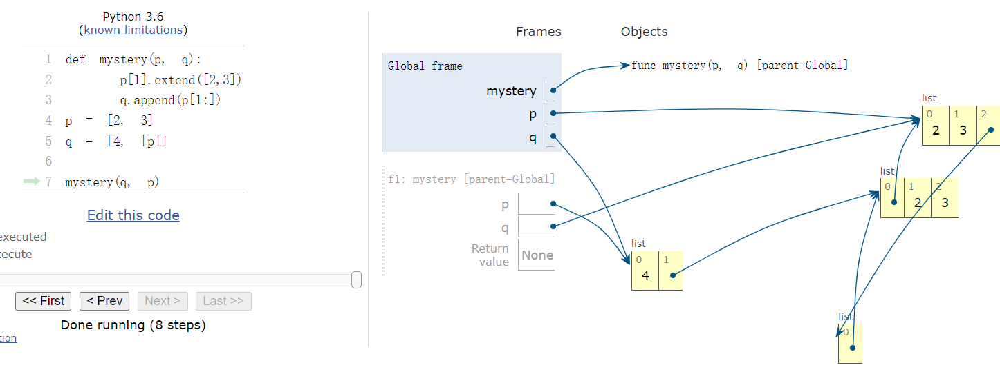

#### 1
已知有一个函数，想要模仿if条件语句：
def if_function(condition, true_result, false_result):
    """Return true_result if condition is a true value, and
    false_result otherwise.

    >>> if_function(True, 2, 3)
    2
    >>> if_function(False, 2, 3)
    3
    >>> if_function(3==2, 3+2, 3-2)
    1
    >>> if_function(3>2, 3+2, 3-2)
    5
    """
    if condition:
        return true_result
    else:
        return false_result

我们现在想要证明，这个函数其实并不像doctest里面那样总能正常工作
例如，我们给出这样的一个例子：
首先，我们定义两个函数：
def with_if_statement():
    """
    >>> result = with_if_statement()
    47
    >>> print(result)
    None
    """
    if cond():
        return true_func()
    else:
        return false_func()

def with_if_function():
    """
    >>> result = with_if_function()
    42
    47
    >>> print(result)
    None
    """
    return if_function(cond(), true_func(), false_func())

我们可以恰当的编写cond(), true_func(), false_func()这三个函数，从而使得with_if_statement()只打印47，而with_if_function()打印42和47

mysolution:
def true_func():
    return print("42")


def false_func():
    return print("47")

def cond():
    return False

原因解释：我们将cond(),true_func(), false_func()三个函数当作参数传递给with_if_function时，with_if_function会先计算出这三个函数，从而赋值给它的形参，然后再做主函数体中的内容，而if条件语句是先计算cond(),然后再根据条件执行对应的函数

### 2 编辑距离
对于用递归求解的问题，应该是考虑当前状态可以由那些状态转移到当前状态，而不是说从当前状态去推算其他状态。其实这一点在最后递归函数的核心表达式里也有体现，它应该是从已知的状态里面去推算，从已知的状态到现在的状态的计算。
而且，同时也要注意收敛。求递归式一定要收敛到base case.如果写出来的递归式好像不收敛，那么很有可能是递归式写错了，要换一种思路

### 3.mystery / 关于List的深入理解



### 4.利用生成函数生成排列
```python
def permutations(seq):
    """Generates all permutations of the given sequence. Each permutation is a
    list of the elements in SEQ in a different order. The permutations may be
    yielded in any order.

    >>> perms = permutations([100])
    >>> type(perms)
    <class 'generator'>
    >>> next(perms)
    [100]
    >>> try: #this piece of code prints "No more permutations!" if calling next would cause an error
    ...     next(perms)
    ... except StopIteration:
    ...     print('No more permutations!')
    No more permutations!
    >>> sorted(permutations([1, 2, 3])) # Returns a sorted list containing elements of the generator
    [[1, 2, 3], [1, 3, 2], [2, 1, 3], [2, 3, 1], [3, 1, 2], [3, 2, 1]]
    >>> sorted(permutations((10, 20, 30)))
    [[10, 20, 30], [10, 30, 20], [20, 10, 30], [20, 30, 10], [30, 10, 20], [30, 20, 10]]
    >>> sorted(permutations("ab"))
    [['a', 'b'], ['b', 'a']]
    """
    "*** YOUR CODE HERE ***"

    if len(seq) == 1:
        for _ in range(1):
            yield seq
    else:
        subs = permutations(seq[1:])
        for s in subs:
            for k in range(len(seq)):
                ret = s.copy()
                ret.insert(k, seq[0])
                yield ret
```
主要就是注意生成函数如果不产生yield后就相当于for 循环到了最后了，就不再迭代了，因为迭代完成了

### 5 ants.optional problem 4
到底怎么简洁地协调状态之间的关系，以及不同的函数，是一个很值得深思的问题

### 6. yield from 的巧妙用法
```python
def filter_link(link, f):
    """
    >>> link = Link(1, Link(2, Link(3,Link(5,Link(4)))))
    >>> g = filter_link(link, lambda x: x % 2 == 0)
    >>> next(g)
    2
    >>> next(g)
    StopIteration
    >>> list(filter_link(link, lambda x: x % 2 != 0))
    [1, 3]
    """
    if link is Link.empty:
        return
    if f(link.first):
        yield link.first

    yield from filter_link(link.rest, f)  # yield from 这个用法就很屌啊

```

### 7 python中的对象
python中，一切皆对象
python中所有的赋值语句都只是把一个变量名关联到一个对象而已，所以即使有很多个赋值，很多个变量，如果它们都是用同一个值并且用赋值语句生成的，那么最终的对象只有一个，所有的变量都通过指针指向这唯一的对象，所有对对象的操作会波及到所有的变量。
这样的做法是有利有弊的，利就是函数中传递的所有参数变量都是一个指针，可以通过指针修改参数指向的对象。弊就是维护需要仔细考虑

这是向链表中插入一个元素，传递过来的link虽然是一个形参，但是由于Python的机制，它指向的对象和实参指向的对象其实是同一个，只能通过这个机制去修改对象，从而对实参也产生影响
```python
def insert(
    link, value, index
):  # 一定要注意，函数传进来的参数只是一个指针，而且是一个拷贝的指针，怎么修改原来的对象要想好
    """Insert a value into a Link at the given index.

    >>> link = Link(1, Link(2, Link(3)))
    >>> print(link)
    <1 2 3>
    >>> insert(link, 9001, 0)
    >>> print(link)
    <9001 1 2 3>
    >>> insert(link, 100, 2)
    >>> print(link)
    <9001 1 100 2 3>
    >>> insert(link, 4, 5)
    IndexError
    """
    if index == 0 and link != Link.empty:
        first = link.first
        link.first = value
        link.rest = Link(first, link.rest)
    elif link == Link.empty:
        raise IndexError
    else:
        insert(link.rest, value, index - 1)

```

### 8 scheme 的参数计算
```scheme
(define foo (lambda (x y z) (if x y z)))
(foo 1 2 (print 'hi))

```
输出结果:
```
hi
2
```
因为虽然if语句在计算的时候只计算一个其中的一个值，但是在将参数传递给foo函数的过程中，每个参数都是需要计算的，所以会多一行hi

### 9 my-append
Write a function which takes two lists and concatenates them.
Notice that simply calling (cons a b) would not work because it will create a
deep list. Do not call the builtin procedure append, which does the same thing as
my-append.
cons 方法很神奇，假如说a是一个list x是一个primitive element, 则(cons a x)是一个深链表，但是(cons x a)则是一个浅链表
(define (my-append a b)
    (cond 
        ((null? a) b)
        (else
            (cons (car a) (my-append (cdr a) b))
        )
    )
)
scm> (my-append '(1 2 3) '(2 3 4))
(1 2 3 2 3 4)
