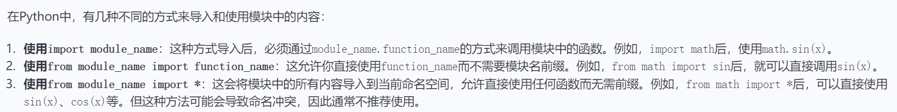
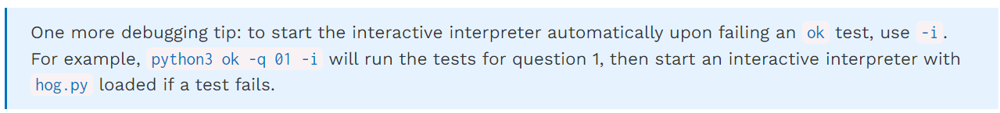

### 完成代码前运行一些小测试：
python3 ok -q python-basics -u --local
### 写完代码后，执行测试:
python3 ok --local
### 运行python文件：
python3 filename.py
### 运行doctest:
python3 -m doctest "filename"
### 用于doctest，而不希望被导入时运行的测试代码：
if __name__ == "__main__":
    import doctest
    doctest.testmod()
(注意，在docstring里面，如果要用doctest,在>>>后面需要加一个空格)
### 引用自己写的库：
import modulename
(原文件为modulename.py)

即使import了库，也要通过形如"modulename.funcname"来使用模块中的函数

### proj1 hog:
1.使用GUI:
python3 hog_gui.py
2.运行特定问题：
python3 ok -q [question number] -i 
3.交互式调试：

